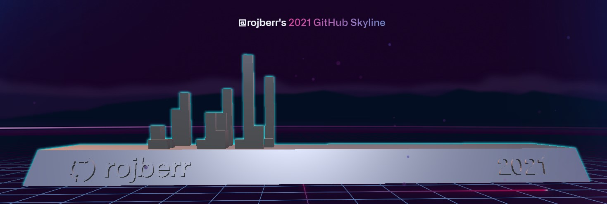

[](https://git.io/typing-svg)

<!--
**rojberr/rojberr** is a ✨ _special_ ✨ repository because its `README.md` (this file) appears on your GitHub profile.

- 🔭 I’m currently working on ...
- 😄 Pronouns: ...
- ⚡ Fun fact: ...
- - 🌱 I’m currently learning ...
- 👯 I’m looking to collaborate on ...
- 🤔 I’m looking for help with ...
- 💬 Ask me about ...

-->

 

I'm Jakub and I'm an engineer who loves to code. Since I created my first program, I can't stop thinking about new ideas and how to implement them.  I spend a lot of time learning new skills and actively help other people learn software development through a variety of help groups and through writing own code. This short summary is my Personal Operating Manual - communicates at scale how I collaborate.

## My current priorities ☑️

On a global level, these are my **priorities**:

- Being a supportive and present friend and collegue
- Learn & Teach 👾
  * Have time to pursue lerning projects and things that interest me 👨‍🏫 especially deploying applications and ML systems securely to productions
  * Teach other people things I already know and thus improve your own skills 🔨
  * Start creating online how-tos and tutorial content to reach more ppl interested in same topics as I am 🙋‍♂️💁🏽🙍🏻
- Stick to my sport and diet plan 🏋️‍♀️🥦 

If my activities or priorities happen to change, I’ll update this page to reflect those changes. Last update was **Sunday, November 12th, 2023**.

## Who am I :point_down:? - About me
```yaml
apiVersion: v29
kind: Human
metadata:
  name: Jakub
spec:
  website:
    - type: Homepage
      where: drzymala.site
  favorites:
    moto: 🏍️
    landscape: ⛰️
    emoji: 🤦
    element: 💨
```

- I prioritize the well-being of individuals above all else. Whenever I evaluate new work, my first question is: "How will this affect a person’s life— their time, mental health, stress levels, sense of accomplishment, planned PTO, and more?"
- I value long, uninterrupted periods for deep work. I disable all notifications on my Mac and only allow iMessage on my phone to maintain focus. This approach helps me work more efficiently by concentrating on one task at a time rather than multitasking. In return, when I do respond, you’ll have my full attention, along with a thoughtful and context-rich reply.
- I try to express gratitude frequently, and it is always sincere.
- Unless stated otherwise, I don’t expect immediate replies from anyone. I respect your time and want to give you the space for a thoughtful response. I embrace asynchronous workflows when possible.

## Website

- :newspaper: You can find my dev site at <https://www.drzymala.site/>

## Contact

- 📫 How to reach me: **contact.drzymala@gmail.com**
<br><br>

Let's get in touch! You can find me on:
<div align="left">
  <a href="https://twitter.com/rojberr_" target="_blank"></a>
  <a href="https://www.linkedin.com/in/jakub-drzymala/" target="_blank"></a>
</div>

## My current stack

<h3 style="text-align: center">Programming languages that I usually use ... ⚡</h3>
<p align="center">
  <a href="https://skillicons.dev">
    
  </a>
</p>

<p align="center"><h3>Frameworks 🏗️</h3></p>
<p align="center">
  <a href="https://skillicons.dev">
    
  </a>
</p>

<p align="center"><h3>DevOps 👷‍♂️</h3></p>
<p align="center">
  <a href="https://skillicons.dev">
    
  </a>
</p>

<p align="center"><h3>Cloud ☁️</h3></p>
<p align="center">
  <a href="https://skillicons.dev">
    
  </a>
</p>

<p align="center"><h3>Monitoring 🔎</h3></p>
<p align="center">
  <a href="https://skillicons.dev">
    
  </a>
</p>

<p align="center"><h3>Tools und IDEs ⚒️</h3></p>
<p align="center">
  <a href="https://skillicons.dev">
    
  </a>
</p>

## Stats 📈

<p align="left">
 &nbsp;
</p>

<br>
<hr>
<br>

If you want to support me, you can do so through my [GitHub Sponsors](https://github.com/sponsors/rojberr)



